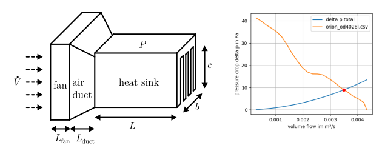
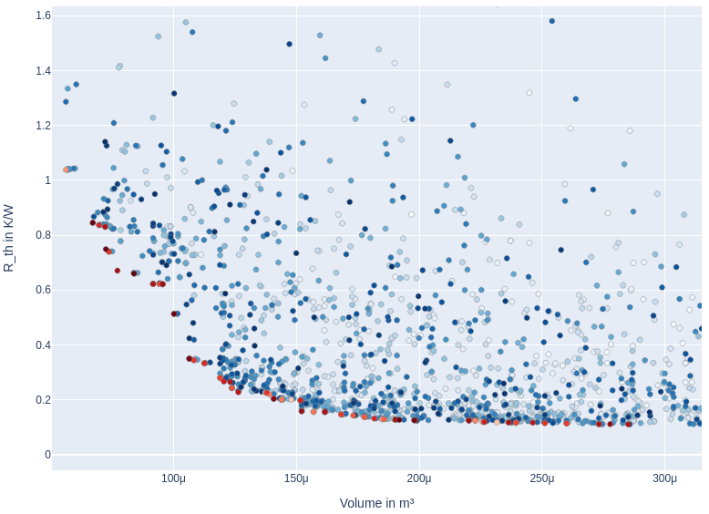

# Welcome to the heat sink computation toolbox
Heat sink dimensioning based on analytical calculation of thermal resistance. 



The pressure loss through the cooling system is determined by the specified geometry and the fan. This allows the volume flow rate to be determined. The volume flow can then be used to determine the thermal resistance.


The estimate of the geometry parameters and the fan is mapped to the costs (volume, R_th) using Pareto optimization. 
About 40 fan characteristic curves are stored in the toolbox.



## Installation
Install in developer mode.
```
git clone git@github.com:upb-lea/HCT_heat_sink_computation_toolbox.git
cd HCT_heat_sink_computation_toolbox/
pip install -e .
```

## Usage and examples
Check out the examples in [this directory](examples/). 


## Literature
This toolbox implements the thermal basics according to the following paper:
```
Christoph Gammeter, Florian Krismer and Johann W. Kolar
Weight Optimization of a Cooling Sysetm Composed of Fan and Extruded Fin Heat Sink
```
Heat spreading is implemented according to the following Ph.D. thesis:
```
Christoph Gammeter
Multi-Objective Optimization of Power Electronics and Generators of Airborne Wind Turbines
```
This is supplemented by various calculations and optimizations. E.g. a Pareto optimization is added.

## Bug reports
Please use the issues report button within GitHub to report bugs.

## Contributing
Pull requests are welcome. For major changes, please open an issue first to discuss what you would like to change.

## Changelog
Find the changelog [here](CHANGELOG.md).

